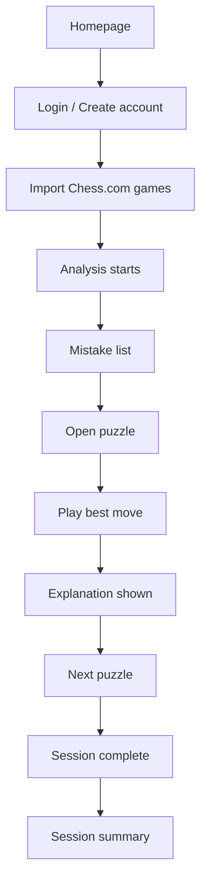
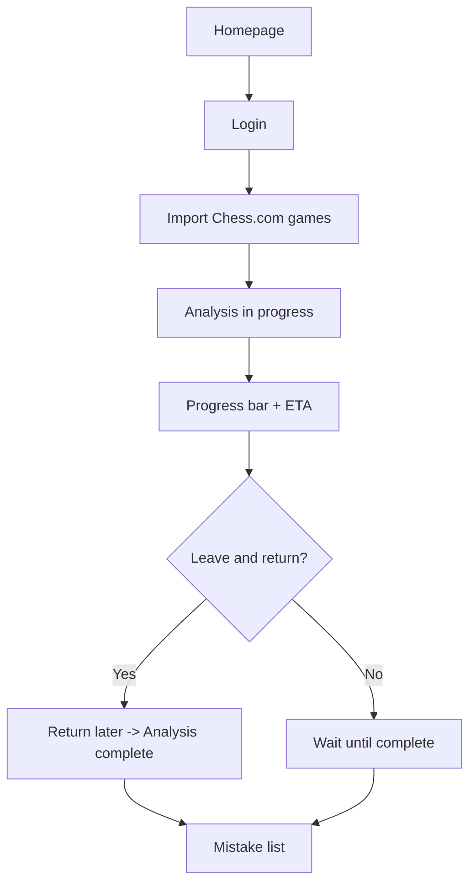
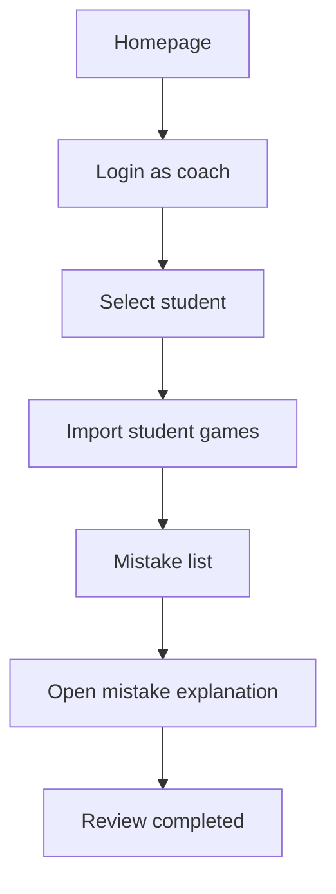

# UX Design Specification ChessTrainer

**Author:** Romain
**Date:** 2026-02-05

---

<!-- UX design content will be appended sequentially through collaborative workflow steps -->

## Executive Summary

### Project Vision

ChessTrainer is a focused web app that helps intermediate chess players improve by turning their real game mistakes into fast, targeted training. The core loop is import → analyze → replay → explain, optimized for short 10–15 minute sessions.

### Target Users

- Primary: intermediate players (~1400–2000 Elo), tech‑savvy, time‑boxed sessions (10–15 min), desktop/laptop usage.
- Secondary: coaches who want fast, targeted feedback from real mistakes.

### Key Design Challenges

- Make the core loop feel effortless and fast for short sessions.
- Build trust during analysis delays (progress bar + ETA).
- Keep the interface minimal and focused to avoid cognitive overload.
- Ensure clarity of explanations (users want “just enough,” not noise).

### Design Opportunities

- Create a “laser‑focused” experience that feels like: “Parfait, je voulais juste ça, pas plus.”
- Use a clean, low‑friction flow that gets users to their first puzzle in minutes.
- Reinforce progress with compact summaries after each session.

## Core User Experience

### Defining Experience

The core action is solving mistake‑based puzzles. Users repeatedly enter short puzzle sessions built from their own errors.

### Platform Strategy

Single‑page web app (SPA), desktop/laptop first, mouse/keyboard interactions. No mobile app required in MVP.

### Effortless Interactions

- One‑click Chess.com import should feel frictionless and automatic.
- Starting a puzzle session should require minimal steps.

### Critical Success Moments

- The explanation for each move (why the user’s move is wrong and the best move is correct) must be crystal‑clear.  
- This explanation is the make‑or‑break moment for user trust and perceived value.

### Experience Principles

- **Explain > Evaluate:** insight matters more than engine judgment.  
- **Fast to first puzzle:** minimize steps between login and training.  
- **Clarity over volume:** concise explanations that feel “just right.”  
- **Trust through transparency:** users feel guided, not judged.

## Desired Emotional Response

### Primary Emotional Goals

- **Simplicity:** the product should feel effortless and obvious.

### Emotional Journey Mapping

- **Discovery:** curiosity and openness.  
- **Core experience:** clarity and simplicity while solving mistakes.  
- **After success:** pride and motivation (“I finally understood my errors”).  
- **When things go wrong (slow analysis):** preserve curiosity instead of frustration.  
- **Return usage:** motivated and confident to keep progressing.

### Micro-Emotions

- **Pride** and **motivation** are the most important micro‑emotions.  
- **Clarity** should replace confusion during explanations.

### Design Implications

- Explanations must be concise and transparent to create **clarity**.  
- Progress feedback should reduce anxiety and protect **curiosity**.  
- Celebrate small wins to reinforce **pride**.

### Emotional Design Principles

- **Clarity first:** remove any ambiguity in explanations.  
- **Calm focus:** no noise, no overload.  
- **Reward insight:** reinforce the feeling of “I understood.”

## UX Pattern Analysis & Inspiration

### Inspiring Products Analysis

- **Chess.com**
  - Strong navigation and clear structure for complex chess content.
  - Simplicity in the core play/analyze flows.

- **Trade Republic**
  - Clean, minimal UI with high clarity.
  - Simple navigation that reduces cognitive load.

### Transferable UX Patterns

- **Clear information hierarchy** to keep users focused on the next action.
- **Minimalist layouts** that prioritize one primary action per screen.
- **Fast access to core task** (jump quickly into puzzles).

### Anti-Patterns to Avoid

- **Overloaded screens** with too many elements or decisions at once.

### Design Inspiration Strategy

**Adopt:**
- Chess.com’s clarity in structuring complex content.
- Trade Republic’s minimal, distraction‑free UI.

**Adapt:**
- Reduce chess UI density to a single‑focus experience.
- Keep training sessions compact and linear.

**Avoid:**
- Any cluttered dashboards or multi‑panel layouts that slow users down.

## Design System Foundation

### 1.1 Design System Choice

**Themeable system** (e.g., MUI / Chakra / Tailwind UI) for balance between speed and uniqueness.

### Rationale for Selection

- **Balance of speed and flexibility** (priority = équilibre).
- **Beginner‑friendly** ecosystem with good docs and community.
- **Accessible by default** (aligns with WCAG 2.1 AA).
- **Works with a partial visual identity** (light brand guidance, not full system).

### Implementation Approach

- Start with a themeable component library as the base.
- Keep the component set minimal for MVP (buttons, cards, forms, tabs, progress, etc.).
- Extend only when needed for chess‑specific UI (board, puzzle states).

### Customization Strategy

- Define basic design tokens (colors, typography, spacing).
- Use the theme to enforce clarity + simplicity.
- Prioritize high contrast and readability across key screens.

## 2. Core User Experience

### 2.1 Defining Experience

“An app to become better at chess by replaying your real mistakes and understanding why they were wrong.”

### 2.2 User Mental Model

Users believe improvement comes from reviewing their own games, manually finding mistakes, and learning the correct moves.

### 2.3 Success Criteria

The session feels successful when the app correctly identifies mistakes and the user clearly understands why the best move was better.

### 2.4 Novel UX Patterns

Uses **known patterns** (review → puzzle → explanation) with a simplified, focused flow.

### 2.5 Experience Mechanics

**Initiation:** User imports their games.  
**Interaction:** User replays mistake positions and selects the correct move.  
**Feedback:** Clear explanations confirm why the user’s move was wrong and the best move is right.  
**Completion:** User feels they understood their errors and finishes the session.

## Visual Design Foundation

### Color System

**Dark Theme Palette**
- Background: #05070f
- Surface: #0d1324
- Surface Muted: #111a30
- Text: #e6edf7
- Muted Text: #98a2b3
- Border: #1c2742
- Primary: #7bb3ff
- Primary Strong: #5a8eff
- Danger: #f06a87

**Tone:** sober, premium, minimal contrast noise.

### Typography System

- **Primary:** Sora (300–700), fallback: sans‑serif.
- **Mono (optional):** Space Mono for technical or detail labels.
- **Content width:** max 1080px with generous margins.
- **Hierarchy:** large, readable headings; short copy blocks.

### Spacing & Layout Foundation

- **Density:** airy / spacious.
- **Grid:** 12‑column responsive grid.
- **Base spacing unit:** 8px.
- **Border radius:** 10–20px range.
- **Shadows:** very light, subtle elevation only.

### Accessibility Considerations

- Ensure contrast ratios meet WCAG 2.1 AA.
- Prioritize legibility for dark theme text.

## Design Direction Decision

### Design Directions Explored

- Direction 2: Minimalist Rail (single column, focus mode).
- Direction 3: Split Board + Insight (insight content framing).

### Chosen Direction

**Base = Direction 2**, with single‑column layout.  
Key choices:
- **Single column** (no split).
- **Explanation under the board** (stacked flow).
- **Progress at top** (session 10‑min / 2‑of‑5 style).
- **No “Submit Move” button**: move applies immediately on click.

### Design Rationale

- Maximizes clarity and speed for 10–15 minute sessions.
- Keeps cognitive load low (one primary action at a time).
- Preserves the “just enough” explanation moment.

### Implementation Approach

- Top progress header → board → explanation card → next action.
- Insight content from Direction 3 translated into concise stacked cards.
- Interaction feedback immediate to reinforce confidence.

## User Journey Flows

### Leo — Happy Path (Import → Analyze → Puzzle)

### Leo — Edge Case (Slow Analysis)

### Coach — Student Review

### Journey Patterns

- Entry always starts from **Homepage → Login**.
- **Import → Analysis → Mistake list** is the shared backbone.
- Explanation is the key value moment in every flow.

### Flow Optimization Principles

- Keep paths linear, with one primary action per step.
- Show progress feedback immediately to avoid drop‑off.
- End each session with a clear “done” state and summary.

## Component Strategy

### Design System Components

Use standard themeable components for speed and consistency:

- Buttons (primary/secondary/ghost)
- Inputs and Selects
- Cards / Panels
- Tabs / Segmented controls
- Progress bars / Loaders
- Badges / Pills
- Alerts / Toasts
- Modal / Dialog

### Custom Components

### Board

**Purpose:** Interactive chessboard for replaying mistake positions.  
**Usage:** Core training surface in puzzle sessions.  
**Anatomy:** Board grid, pieces, active turn, highlight layers.  
**States:** default, selected square, legal move hint, correct move, wrong move, loading.  
**Variants:** training mode, review mode.  
**Accessibility:** keyboard navigation, focus outline, ARIA labels for squares/moves.  
**Interaction Behavior:** move applies immediately on click (no submit button).

### Puzzle

**Purpose:** Encapsulate one mistake challenge as a focused step.  
**Usage:** Sequence of puzzle steps during session.  
**Anatomy:** position context, objective, board, status banner.  
**States:** pending, active, solved, failed, skipped.  
**Variants:** short drill, full explanation mode.  
**Accessibility:** clear status text, keyboard shortcuts for next/previous.

### Explanation Panel

**Purpose:** Explain why user move was wrong and best move is right.  
**Usage:** Directly under board in single-column flow.  
**Anatomy:** wrong-move reason, best-move rationale, key takeaway.  
**States:** hidden, loading, ready, expanded, collapsed.  
**Variants:** concise view, detailed view.  
**Accessibility:** semantic headings, readable contrast, screen-reader friendly structure.

### Progress Summary

**Purpose:** Show session progression and completion feedback.  
**Usage:** Top progress header + end-of-session summary.  
**Anatomy:** step counter, completion %, quick recap metrics.  
**States:** in-progress, completed, empty/no session.  
**Variants:** compact header, full summary card.  
**Accessibility:** numeric + text progress labels.

### Component Implementation Strategy

- Build standard UI first using themeable system primitives.
- Implement custom components with shared tokens (color, spacing, typography).
- Keep interaction model single-column and low-friction.
- Enforce WCAG 2.1 AA contrast and keyboard support from v1.

### Implementation Roadmap

**Phase 1 (MVP Core):**
- Board
- Puzzle
- Explanation Panel
- Progress Summary

**Phase 2 (Support):**
- Enhanced puzzle variants
- Expanded explanation modes

**Phase 3 (Enhancements):**
- Coach-focused component extensions
- Rich analytics components

## UX Consistency Patterns

### Button Hierarchy

- One primary CTA per screen.
- Primary action style uses `#7bb3ff`.
- Secondary actions use muted/ghost variants.
- Destructive actions use Danger color `#f06a87`.
- Disabled state is always visible and non-clickable.

### Feedback Patterns

- Success and error feedback use:
- Toast at top-right for global status.
- Inline message inside the active panel for contextual clarity.
- Copy is short, explicit, and actionable.

### Form Patterns

- Validation is triggered on submit (not on blur/live).
- Invalid fields are highlighted with inline error text.
- Submit is blocked only after submit attempt if required fields are invalid.
- Error summary appears at top of form when multiple fields fail.

### Navigation Patterns

- Desktop navigation uses top bar + section tabs.
- No sidebar in MVP.
- Current tab is always visually explicit.
- Back/close actions keep users in a linear flow.

### Additional Patterns

- Loading states: skeleton + short action-oriented text.
- Empty states: concise guidance with one clear next action.
- Progress visibility: top progress indicator in training flows.
- Consistent spacing and hierarchy to preserve low cognitive load.

## Responsive Design & Accessibility

### Responsive Strategy

- MVP is **desktop/laptop-first** with a **single-column** layout.
- Extra screen width is used for breathing room (larger margins/padding), not additional columns.
- No dedicated mobile experience in this first version; below desktop widths is best-effort fallback only.
- Primary use context remains short 10–15 minute sessions on laptop/desktop.

### Breakpoint Strategy

- **Compact Desktop:** `1024px–1279px`
- **Standard Desktop:** `1280px–1439px`
- **Wide Desktop:** `1440px+`
- Below `1024px`: unsupported target for MVP, but UI should remain readable with reduced spacing when possible.

### Accessibility Strategy

- Target compliance: **WCAG 2.1 AA**.
- Ensure color contrast meets minimum AA ratios (4.5:1 for normal text).
- Full keyboard navigation for core actions, including board interaction and puzzle flow.
- Persistent visible focus states on all interactive elements.
- Semantic structure + ARIA labels for board squares, move feedback, and explanation sections.
- Minimum target size of `44x44px` for clickable/touchable controls.

### Testing Strategy

- **Browser coverage (MVP):** latest Chrome + Safari on desktop.
- **Responsive checks:** 1024, 1280, 1440, and 1920 widths.
- **Automated accessibility checks:** Lighthouse + axe.
- **Manual accessibility checks:** keyboard-only navigation, focus order, VoiceOver smoke test, contrast validation.

### Implementation Guidelines

- Use desktop-first CSS with responsive spacing/container scales.
- Keep main content in a centered container (`max-width: 1080px`) with adaptive paddings.
- Prefer semantic HTML and minimal ARIA (only where native semantics are insufficient).
- Manage focus transitions after move validation and puzzle completion.
- Respect reduced-motion preferences for all animations/transitions.
- Keep component states explicit (`loading`, `error`, `success`, `empty`) for predictable UX and assistive support.
