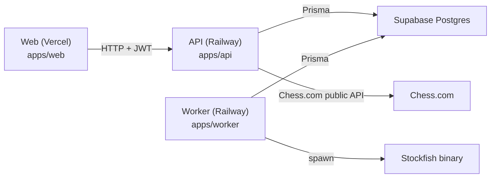

# ChessTrainer - Architecture & Ops Notes

This document is a pragmatic map of the codebase + runtime so a future session can quickly find “where things are” and “how it’s deployed”.

Canonical production web URL: https://yourchesstrainer.vercel.app

## Services (Runtime)

- **Web SPA** (Vite + React) : `apps/web`
  - Auth UI via **Supabase Auth** (anon key)
  - Calls the API using `VITE_API_BASE_URL`
- **API** (NestJS) : `apps/api`
  - Verifies Supabase JWTs (bearer token) via `SUPABASE_URL` / `SUPABASE_JWT_AUDIENCE`
  - Uses Prisma to read/write Postgres (Supabase)
  - Enqueues analysis jobs in DB
- **Worker** (Node + TS) : `apps/worker`
  - Polls DB for queued analysis jobs
  - Runs **Stockfish** analysis per ply
  - Writes evaluations + critical mistakes + refreshed summaries back to DB

## Monorepo Layout

- `apps/web/`: Vite SPA (routes, UI components, API client wrappers)
- `apps/api/`: NestJS API (controllers/services/modules + Prisma schema)
- `apps/worker/`: background worker that executes analysis jobs
- `packages/shared-contracts/`: shared TS types/contracts used by web/api/worker
- `railway/`: Railway “config-as-code” TOML files (build/start commands)
- `scripts/`: repo scripts (smoke tests, perf checks, security baseline)
- `_bmad-output/`: BMAD planning artifacts (PRD, UX spec, checklists, brainstorming)

## Web App (`apps/web`)

### Routes

Defined in `apps/web/src/app/router.tsx`.

- `/register`, `/login`
- `/onboarding` (protected)
- `/puzzle` (protected)
- `/progress`, `/progress/trends` (protected)
- `/data/inventory` (protected)
- `/coach/context`, `/coach/review` (protected)

### MVP Custom Components

- Board: `apps/web/src/components/Board/Board.tsx`
- App layout (sidebar): `apps/web/src/components/AppLayout/AppLayout.tsx`
- Puzzle card: `apps/web/src/components/Puzzle/Puzzle.tsx`
- Explanation panel: `apps/web/src/components/ExplanationPanel/ExplanationPanel.tsx`
- Progress summary: `apps/web/src/components/ProgressSummary/ProgressSummary.tsx`
- Eval bar: `apps/web/src/components/EvalBar/EvalBar.tsx`
- Puzzle trainer (session UI): `apps/web/src/features/puzzles/PuzzleTrainer.tsx`

### Env Vars (Vercel)

Validated in `apps/web/src/config/env.ts`.

- `VITE_API_BASE_URL`
- `VITE_SUPABASE_URL`
- `VITE_SUPABASE_ANON_KEY`
- optional: `VITE_SENTRY_DSN`, `VITE_SENTRY_ENVIRONMENT`, `VITE_SENTRY_RELEASE`

Local note (monorepo): `apps/web/vite.config.ts` points `envDir` to the repo root so a root `.env`
is picked up by Vite (only `VITE_*` variables are exposed client-side).

## API (`apps/api`)

### Key Endpoints

- `GET /health` (healthcheck)
- Auth:
  - `GET /auth/me`
  - `POST /auth/delete-account` (requires `confirm_deletion=true`)
  - `GET /auth/audit-logs?limit=...`
- Import (Chess.com):
  - `GET /imports/chess-com/candidate-games?username=...&archives_count=...`
  - `POST /imports/chess-com/import-selected`
  - `POST /imports/chess-com/reimport`
- Analysis:
  - `POST /analysis/jobs` (enqueue by `game_ids[]` or all)
  - `GET /analysis/jobs/:job_id`
- Puzzles:
  - `GET /puzzles/next`
  - `GET /puzzles/session?limit=...`
  - `POST /puzzles/:puzzle_id/attempt`
- Progress:
  - `GET /progress/summary`
  - `GET /progress/trends?days=...&limit=...`
  - `POST /progress/sessions`
- Data deletion:
  - `GET /data/inventory`
  - `POST /data/delete-datasets`
- Coach (optional / secondary):
  - `GET /coach/students`
  - `POST /coach/context/select`
  - `POST /coach/review/import`
  - `GET /coach/review/mistakes`

Controllers live in `apps/api/src/modules/**/**.controller.ts`.

### Auth Model

Web obtains a Supabase JWT; API verifies it and maps it to a local `users` row.

- `users.supabase_sub` is the unique link to Supabase auth identity.

### DB Schema (Prisma)

Source of truth: `apps/api/prisma/schema.prisma`.

Core tables:

- `users`
- `games` (imported PGN + chess.com metadata)
- `analysis_jobs` (status: `queued | running | completed | failed`)
- `analysis_move_evaluations` (per-ply evaluation snapshots)
- `critical_mistakes` (mistake extraction for puzzle generation)
- `user_mistake_summaries` (aggregated patterns over recent jobs)
- `puzzle_sessions`
- `audit_logs`
- `coach_student_accesses` (secondary / coach workflow)

### Env Vars (Railway)

The canonical list is in `.env.example` (API + worker share some keys).

Required for API:

- `DATABASE_URL` (Supabase Postgres URL, typically pooler)
- `WEB_APP_ORIGIN` (must match the Vercel domain you use, e.g. `https://yourchesstrainer.vercel.app`)
- `SUPABASE_URL`
- `SUPABASE_JWT_AUDIENCE=authenticated`
- `SUPABASE_SERVICE_ROLE_KEY` (only on server; never expose to web)

Optional:

- `SENTRY_DSN`, `SENTRY_ENVIRONMENT`, `SENTRY_RELEASE`
- Chess.com tuning: `CHESSCOM_API_BASE_URL`, `CHESSCOM_RETRY_*`

## Worker (`apps/worker`)

### What It Does

- Polls `analysis_jobs` where `status='queued'`
- Locks a job (`queued -> running`)
- Replays PGN, and for each ply:
  - calls Stockfish on the current FEN
  - writes `analysis_move_evaluations`
  - updates progress + ETA on the job
- Extracts `critical_mistakes` (eval drops) and refreshes `user_mistake_summaries`

Main code:

- Entry: `apps/worker/src/main.ts`
- Worker loop: `apps/worker/src/services/analysis-worker.service.ts`
- Stockfish wrapper: `apps/worker/src/services/stockfish.service.ts`
- Config parsing: `apps/worker/src/config.ts`

### Env Vars (Railway)

Required:

- `DATABASE_URL` (must be Supabase, not localhost)

Stockfish:

- `STOCKFISH_BIN_PATH=stockfish` (default is `stockfish`)
- Ensure the binary exists in the container (Railway Nixpacks):
  - `NIXPACKS_PKGS=stockfish`

Tuning:

- `ANALYSIS_TIMEOUT_MS`
- `ANALYSIS_STOCKFISH_DEPTH`
- `WORKER_POLL_INTERVAL_MS`
- `WORKER_BATCH_SIZE`
- `WORKER_RUN_ONCE`

Sentry:

- `WORKER_SENTRY_DSN` (or reuse `SENTRY_DSN`)

## Deploy (Vercel + Railway + Supabase)

### Vercel (Web)

- Deploy `apps/web`
- Set env vars:
  - `VITE_API_BASE_URL` = Railway API base URL (no trailing slash)
  - `VITE_SUPABASE_URL`, `VITE_SUPABASE_ANON_KEY`

### Railway (API + Worker)

Config-as-code files:

- API: `railway/api.railway.toml`
- Worker: `railway/worker.railway.toml`

Notes learned during setup:

- Nixpacks + `npm ci` can fail with `EBUSY` on `/app/node_modules/.cache`.
  - Prefer `npm install --include=dev` in Railway builds.
- Railway healthchecks may run over internal HTTP.
  - API exempts `/health` from HTTPS-only enforcement in `apps/api/src/main.ts`.

## Common Failure Modes (Quick Fixes)

- **Web “fail to fetch”**
  - Check `VITE_API_BASE_URL` in Vercel.
  - Check API `WEB_APP_ORIGIN` matches your active Vercel domain (CORS allowlist), e.g. `https://yourchesstrainer.vercel.app`.
- **Worker crashes + Prisma tries `localhost:5432`**
  - `DATABASE_URL` is missing/wrong on the worker service.
- **`@prisma/client did not initialize yet`**
  - Ensure deploy runs `prisma generate` during build (both API and worker depend on it).
  - Keep Prisma versions aligned across workspaces (API + worker + root).
- **No analysis results**
  - Confirm worker logs show `analysis_job_*` events.
  - Confirm Stockfish is installed and `STOCKFISH_BIN_PATH` is correct.
- **Railway healthcheck failing**
  - Verify `GET /health` returns 200.
  - Confirm API binds to `0.0.0.0` and uses `PORT` (handled in `apps/api/src/main.ts`).

## Local Dev (Quick)

1. Copy env:
   - `.env.example` -> `.env` and fill required values.
2. Install:
   - `npm install`
3. Run:
   - API: `npm run start:dev -w @chesstrainer/api` (run `npm -w apps/api run prisma:generate` if Prisma types are missing)
   - Web: `npm run dev -w @chesstrainer/web`
   - Worker: `npm run dev -w @chesstrainer/worker` (requires `prisma generate` too)

Smoke auth test:

- `scripts/smoke-auth.sh` (expects API running + Supabase configured)
